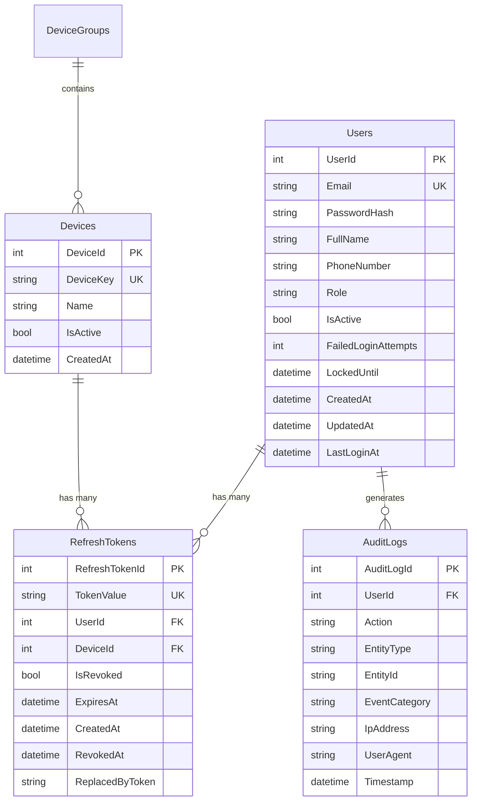

# Database Schema Contract

## Overview
This document defines the database schema and entity relationships for the Authentication System in the Digital Signage application.

## Database Tables

### Users Table
```sql
CREATE TABLE Users (
    UserId          INT IDENTITY(1,1) PRIMARY KEY,
    Email           NVARCHAR(255) NOT NULL UNIQUE,
    PasswordHash    NVARCHAR(255) NOT NULL,
    FullName        NVARCHAR(100) NOT NULL,
    PhoneNumber     NVARCHAR(20) NULL,
    Role            NVARCHAR(50) NOT NULL DEFAULT 'User',
    IsActive        BIT NOT NULL DEFAULT 1,
    FailedLoginAttempts INT NOT NULL DEFAULT 0,
    LockedUntil     DATETIME2 NULL,
    CreatedAt       DATETIME2 NOT NULL DEFAULT GETUTCDATE(),
    UpdatedAt       DATETIME2 NOT NULL DEFAULT GETUTCDATE(),
    LastLoginAt     DATETIME2 NULL,
    
    INDEX IX_Users_Email (Email),
    INDEX IX_Users_Role (Role),
    INDEX IX_Users_IsActive (IsActive)
);
```

### RefreshTokens Table
```sql
CREATE TABLE RefreshTokens (
    RefreshTokenId  INT IDENTITY(1,1) PRIMARY KEY,
    TokenValue      NVARCHAR(255) NOT NULL UNIQUE,
    UserId          INT NOT NULL,
    DeviceId        INT NULL,
    IsRevoked       BIT NOT NULL DEFAULT 0,
    ExpiresAt       DATETIME2 NOT NULL,
    CreatedAt       DATETIME2 NOT NULL DEFAULT GETUTCDATE(),
    RevokedAt       DATETIME2 NULL,
    ReplacedByToken NVARCHAR(255) NULL,
    
    FOREIGN KEY (UserId) REFERENCES Users(UserId) ON DELETE CASCADE,
    FOREIGN KEY (DeviceId) REFERENCES Devices(DeviceId) ON DELETE CASCADE,
    
    INDEX IX_RefreshTokens_TokenValue (TokenValue),
    INDEX IX_RefreshTokens_UserId (UserId),
    INDEX IX_RefreshTokens_ExpiresAt (ExpiresAt),
    INDEX IX_RefreshTokens_IsRevoked (IsRevoked)
);
```

### AuditLogs Table (Enhanced for Auth)
```sql
-- Extends existing AuditLogs table with auth-specific events
ALTER TABLE AuditLogs ADD COLUMN EventCategory NVARCHAR(50) DEFAULT 'General';
ALTER TABLE AuditLogs ADD COLUMN IpAddress NVARCHAR(45) NULL;
ALTER TABLE AuditLogs ADD COLUMN UserAgent NVARCHAR(500) NULL;

-- New indexes for auth queries
CREATE INDEX IX_AuditLogs_EventCategory ON AuditLogs(EventCategory);
CREATE INDEX IX_AuditLogs_UserId_Timestamp ON AuditLogs(UserId, Timestamp);
```

## Entity Relationships



## Data Constraints & Validation

### User Entity
| Field | Type | Constraints | Validation Rules |
|-------|------|-------------|------------------|
| Email | NVARCHAR(255) | NOT NULL, UNIQUE | Valid email format, max 255 chars |
| PasswordHash | NVARCHAR(255) | NOT NULL | BCrypt hash, exactly 60 chars |
| FullName | NVARCHAR(100) | NOT NULL | Min 2 chars, max 100 chars |
| PhoneNumber | NVARCHAR(20) | NULL | Optional, valid phone format |
| Role | NVARCHAR(50) | NOT NULL | Enum: Admin, User, DeviceManager |
| FailedLoginAttempts | INT | DEFAULT 0 | Range: 0-10 |
| LockedUntil | DATETIME2 | NULL | Future date only |

### RefreshToken Entity
| Field | Type | Constraints | Validation Rules |
|-------|------|-------------|------------------|
| TokenValue | NVARCHAR(255) | NOT NULL, UNIQUE | GUID format, exactly 36 chars |
| ExpiresAt | DATETIME2 | NOT NULL | Future date, max 30 days from creation |
| IsRevoked | BIT | DEFAULT 0 | Boolean flag |
| ReplacedByToken | NVARCHAR(255) | NULL | GUID format if present |

## Security Considerations

### Password Security
```sql
-- Password hashing requirements
CONSTRAINT CK_Users_PasswordHash_Length 
    CHECK (LEN(PasswordHash) = 60);  -- BCrypt standard length

-- Account lockout policy
CONSTRAINT CK_Users_FailedAttempts_Range 
    CHECK (FailedLoginAttempts >= 0 AND FailedLoginAttempts <= 10);
```

### Token Security
```sql
-- Refresh token expiry validation
CONSTRAINT CK_RefreshTokens_ExpiresAt_Future 
    CHECK (ExpiresAt > GETUTCDATE());

-- Token value format validation (GUID)
CONSTRAINT CK_RefreshTokens_TokenValue_Format 
    CHECK (TokenValue LIKE '[0-9A-F][0-9A-F][0-9A-F][0-9A-F][0-9A-F][0-9A-F][0-9A-F][0-9A-F]-[0-9A-F][0-9A-F][0-9A-F][0-9A-F]-[0-9A-F][0-9A-F][0-9A-F][0-9A-F]-[0-9A-F][0-9A-F][0-9A-F][0-9A-F]-[0-9A-F][0-9A-F][0-9A-F][0-9A-F][0-9A-F][0-9A-F][0-9A-F][0-9A-F][0-9A-F][0-9A-F][0-9A-F][0-9A-F]');
```

## Database Functions & Procedures

### User Authentication Function
```sql
CREATE FUNCTION fn_ValidateUserLogin(
    @Email NVARCHAR(255),
    @PasswordHash NVARCHAR(255)
)
RETURNS TABLE
AS
RETURN
(
    SELECT 
        UserId,
        Email,
        FullName,
        Role,
        IsActive,
        FailedLoginAttempts,
        LockedUntil
    FROM Users 
    WHERE Email = @Email 
        AND PasswordHash = @PasswordHash
        AND IsActive = 1
        AND (LockedUntil IS NULL OR LockedUntil < GETUTCDATE())
);
```

### Cleanup Expired Tokens Procedure
```sql
CREATE PROCEDURE sp_CleanupExpiredTokens
AS
BEGIN
    SET NOCOUNT ON;
    
    DELETE FROM RefreshTokens 
    WHERE ExpiresAt < GETUTCDATE() 
        OR IsRevoked = 1;
        
    -- Log cleanup activity
    INSERT INTO AuditLogs (UserId, Action, EntityType, EventCategory, Timestamp)
    VALUES (NULL, 'CLEANUP_EXPIRED_TOKENS', 'RefreshToken', 'System', GETUTCDATE());
END;
```

## Indexes for Performance

### Primary Indexes
```sql
-- User lookup by email (login)
CREATE INDEX IX_Users_Email_Active ON Users(Email, IsActive);

-- Refresh token lookup
CREATE INDEX IX_RefreshTokens_Value_Active ON RefreshTokens(TokenValue, IsRevoked, ExpiresAt);

-- Audit log filtering
CREATE INDEX IX_AuditLogs_Category_User_Time ON AuditLogs(EventCategory, UserId, Timestamp DESC);
```

### Composite Indexes
```sql
-- Failed login tracking
CREATE INDEX IX_Users_FailedAttempts_LockedUntil ON Users(FailedLoginAttempts, LockedUntil) 
    WHERE FailedLoginAttempts > 0;

-- Active user tokens
CREATE INDEX IX_RefreshTokens_User_Active ON RefreshTokens(UserId, IsRevoked, ExpiresAt) 
    WHERE IsRevoked = 0;
```

## Data Migration Scripts

### Initial Admin User Creation
```sql
-- Create default admin user
INSERT INTO Users (Email, PasswordHash, FullName, Role, IsActive, CreatedAt, UpdatedAt)
VALUES (
    'admin@digitalsignage.com',
    '$2a$12$rMeWqxGyaGNBNvGoJMxuuOnRrxMrsmF8XYRZhxC.jO4G8gNrqKGzi', -- 'Admin123!'
    'System Administrator',
    'Admin',
    1,
    GETUTCDATE(),
    GETUTCDATE()
);
```

### Audit Log Categories Setup
```sql
-- Insert standard audit categories for authentication
INSERT INTO AuditLogs (UserId, Action, EntityType, EntityId, EventCategory, Timestamp)
VALUES 
    (NULL, 'SYSTEM_INIT', 'AuthSystem', 'v1.0', 'System', GETUTCDATE()),
    (NULL, 'ADMIN_USER_CREATED', 'User', '1', 'Authentication', GETUTCDATE());
```

## Performance Benchmarks

### Expected Query Performance
| Operation | Expected Time | Index Used |
|-----------|---------------|------------|
| User login by email | < 5ms | IX_Users_Email_Active |
| Refresh token validation | < 2ms | IX_RefreshTokens_Value_Active |
| Admin user listing (paginated) | < 10ms | IX_Users_Role |
| Audit log filtering | < 20ms | IX_AuditLogs_Category_User_Time |
| Failed login check | < 3ms | IX_Users_FailedAttempts_LockedUntil |

### Storage Estimates
- **Users**: ~500 bytes per user
- **RefreshTokens**: ~300 bytes per token
- **AuditLogs**: ~200 bytes per log entry

For 10,000 users with average activity:
- Users table: ~5 MB
- RefreshTokens: ~15 MB (avg 50 tokens per user)
- Additional AuditLogs: ~50 MB (auth events)