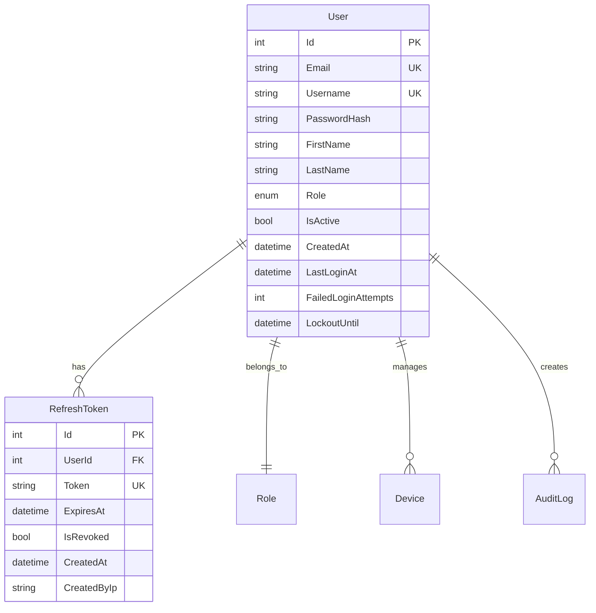

# Data Model & Schema

## Entity Relationships



## Database Tables

### Users Table Extensions
```sql
ALTER TABLE Users ADD COLUMN Role varchar(20) NOT NULL DEFAULT 'Viewer';
ALTER TABLE Users ADD COLUMN LastLoginAt timestamp;
ALTER TABLE Users ADD COLUMN FailedLoginAttempts int NOT NULL DEFAULT 0;
ALTER TABLE Users ADD COLUMN LockoutUntil timestamp;
```

### New RefreshTokens Table
```sql
CREATE TABLE RefreshTokens (
    Id SERIAL PRIMARY KEY,
    UserId int NOT NULL REFERENCES Users(Id) ON DELETE CASCADE,
    Token varchar(500) NOT NULL UNIQUE,
    ExpiresAt timestamp NOT NULL,
    IsRevoked boolean NOT NULL DEFAULT false,
    CreatedAt timestamp NOT NULL DEFAULT CURRENT_TIMESTAMP,
    CreatedByIp varchar(45)
);

CREATE INDEX IX_RefreshTokens_UserId ON RefreshTokens(UserId);
CREATE INDEX IX_RefreshTokens_Token ON RefreshTokens(Token);
CREATE INDEX IX_RefreshTokens_ExpiresAt ON RefreshTokens(ExpiresAt);
```

## Security Considerations

### Password Requirements
- Minimum 8 characters
- Must contain uppercase, lowercase, number, special character
- Hash using BCrypt with work factor 12
- Salt automatically generated per password

### JWT Configuration
- Access tokens: 15 minutes expiry
- Refresh tokens: 7 days expiry
- Use RS256 algorithm with key rotation
- Include minimal claims (user ID, role, expiry)

### Rate Limiting
- Login attempts: 5 per minute per IP
- Password reset: 3 per hour per email
- Token refresh: 10 per minute per user